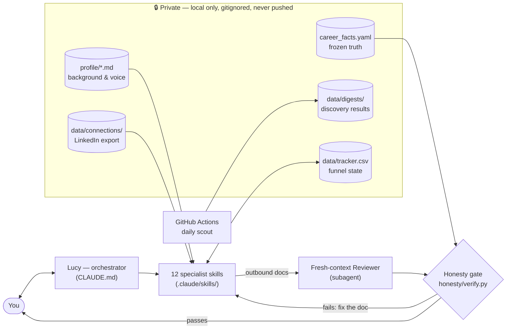

# AI Job Search Agent

[](https://docs.claude.com/en/docs/claude-code/overview)
[](LICENSE)
[](https://www.python.org/)

A job-search agent that runs locally in [Claude Code](https://docs.claude.com/en/docs/claude-code/overview).
One conversational interface ("Lucy", defined in `CLAUDE.md`) routes your requests to 12
specialist skills covering the whole funnel: discover roles → judge fit → tailor documents →
find a warm intro → apply → track → interview → negotiate.

Two rules are enforced in code, not prompts:

- **No fabrication.** Every generated document (CV, cover letter, outreach message) is
  checked by `honesty/verify.py` against `career_facts.yaml`, a frozen record of your real
  history. Unbacked claims fail the check and the document is rewritten.
- **No autonomous submission.** The agent never applies, sends a message, or accepts an
  offer. Submitting requires two independent human confirmations.

## Features

- **Job discovery** — sweeps public ATS APIs (Greenhouse, Lever, Ashby, SmartRecruiters);
  no scraping, no logins. Drops out-of-scope roles before scoring, scores the rest against
  a configurable rubric, and writes a digest to `data/digests/YYYY-MM-DD.md`.
- **CV and cover-letter tailoring** — rewrites your master CV per job description using only
  real content; every draft passes a fresh-context reviewer subagent, then the honesty check.
- **Warm-intro mapping** — finds intro paths into target companies from your own LinkedIn
  connections export. No scraping.
- **Company research and interview prep** — briefings before you apply; likely questions and
  answers built from your own STAR stories.
- **Application tracking** — `data/tracker.csv` holds every application, its stage, and
  dates; the agent surfaces follow-up nudges by elapsed time.
- **Offer negotiation support** — benchmarks, strategy, and scripts. You decide and speak.
- **Optional scheduled scout** — a GitHub Actions workflow runs the discovery sweep on
  weekday mornings and commits the digest.

## Requirements

- A Claude Pro/Max subscription, or an Anthropic API key (only needed for the scheduled scout)
- Node.js (to install Claude Code)
- Python 3 with `pyyaml`

## Quick start

```bash
npm install -g @anthropic-ai/claude-code
git clone https://github.com/HimadriTrying/ai-job-search-agent.git
cd ai-job-search-agent
pip install pyyaml
claude
```

**Already tried it in the browser?** [The try page](https://himadritrying.github.io/ai-job-search-agent/try.html)
can hand you a `lucy-profile-seed.json` built from the CV you pasted there. Import it and skip
the longest part of setup:

```bash
python scripts/import-seed.py ~/Downloads/lucy-profile-seed.json
```

It writes `career_facts.yaml` and `profile/05-cv-source.md`, and marks the facts
`verified: false` until you have read them line by line. Those facts are what the honesty gate
checks every document against, so an error there becomes an error the gate cannot see. Read
them, then set `verified: true`.

To use the scheduled scout, you will need a **private copy** of this repo (not a fork —
forks of public repos are always public). See [Scheduled scout](#scheduled-scout-optional).

## Setup

Inside Claude Code, say `run setup`. The agent interviews you and fills in:

- `profile/*.md` — your background, evaluation criteria, writing style, interview stories.
  Output quality tracks profile depth directly.
- `career_facts.yaml` — every employer, title, date, credential, and metric you can defend.
  This is the honesty check's source of truth; it changes only when your history changes.

All personal files (`career_facts.yaml`, filled `profile/*.md`, `data/`) are gitignored, and
a pre-commit guard (`scripts/check-private.sh`) blocks them from being committed.

## Usage

Talk to the agent in plain language; it routes to the right skill.

| Say | What happens |
|---|---|
| "what's out there for me?" | discovery sweep + scored digest |
| "tailor my CV for this posting: \<url\>" | CV draft → reviewer → honesty check |
| "write the cover letter" | same pipeline |
| "what do I need to know about \<company\>?" | company research briefing |
| "who do I know there?" | warm-intro paths from your connections export |
| "prep me for Thursday's interview" | question prep from hiring-side rubrics |
| "what should I follow up on?" | tracker nudges by elapsed time |
| "I got an offer, help" | benchmark, strategy, scripts |

## Configuration

Discovery is controlled by two files in `.claude/skills/job-scout/` (copy the `.example`
versions to start):

- `watchlist.txt` — target companies, one `ats:token` per line, e.g. `greenhouse:stripe`.
- `config.yaml` — rubric knobs: years of experience, seniority floor, locations, excluded
  industries, comp floor.

Note: `min_seniority` drops roles *below* the floor (default tuning is Senior/Staff PM and
AI-product roles), the inverse of a junior-candidate filter.

### Scheduled scout (optional)

Digests and the watchlist name the companies you are targeting, so the workflow **refuses
to run in a public repository** — on a public repo its logs, artifacts, and commits would
be visible to anyone, and GitHub forks of public repos are always public. Run it from a
private copy:

1. Create a **private copy** (not a fork): on GitHub, **New → Import repository**, paste
   this repo's URL, set visibility to **Private**.
2. In your private copy, commit your scout inputs — they are gitignored by default as
   protection for the public repo, so force-add them:
   ```bash
   git add -f .claude/skills/job-scout/watchlist.txt .claude/skills/job-scout/config.yaml
   git commit -m "Add scout inputs" && git push
   ```
3. Enable workflows under the **Actions** tab and add a repository secret named
   `ANTHROPIC_API_KEY`.
4. `.github/workflows/daily-scout.yml` then runs weekday mornings and commits digests to
   `data/digests/` in the private copy, visible only to you. The sweep and scoring are
   plain Python; the key pays only for the thin orchestration, a few dollars a month.

## How it works



Everything in the private box exists only on your machine: the agent reads it, but it is
gitignored (with a pre-commit guard as backstop) and only the `*.example` templates are in
this repo.

Design rationale: [docs/DESIGN.md](docs/DESIGN.md). Roadmap: [ROADMAP.md](ROADMAP.md).

## Troubleshooting

- **Empty digest / nothing survives scoring** — usually the seniority floor working on a
  watchlist with no senior openings. Check the sweep counts in the digest header; loosen
  `min_seniority` or set `keep_ambiguous: true` in `config.yaml`.
- **Honesty check keeps failing a document** — the draft claims something
  `career_facts.yaml` cannot back. If the claim is real, add it to the facts file;
  otherwise the document gets rewritten. Never weaken a fact to pass the check.
- **Scheduled scout never ran / fails immediately** — the workflow refuses to run in a
  public repo and fails loudly if the watchlist is missing from the checkout; the error
  message says which. Otherwise confirm Actions are enabled in your private copy and the
  `ANTHROPIC_API_KEY` secret is set, then read the run log under the Actions tab.
- **`honesty/verify.py` import error** — `pip install pyyaml` (the only dependency).

## Contributing

Issues and PRs are welcome. Two things are not up for change: the agent never fabricates,
and the human always submits.

## License

MIT. Built after studying
[Scotty Peterson's funnel write-up](https://www.scottypeterson.net/blog/job-hunting-is-a-funnel-problem),
[`ai-job-search`](https://github.com/MadsLorentzen/ai-job-search) (MIT), and
[Lenny's Product Skills](https://github.com/RefoundAI/lenny-skills) (MIT).
