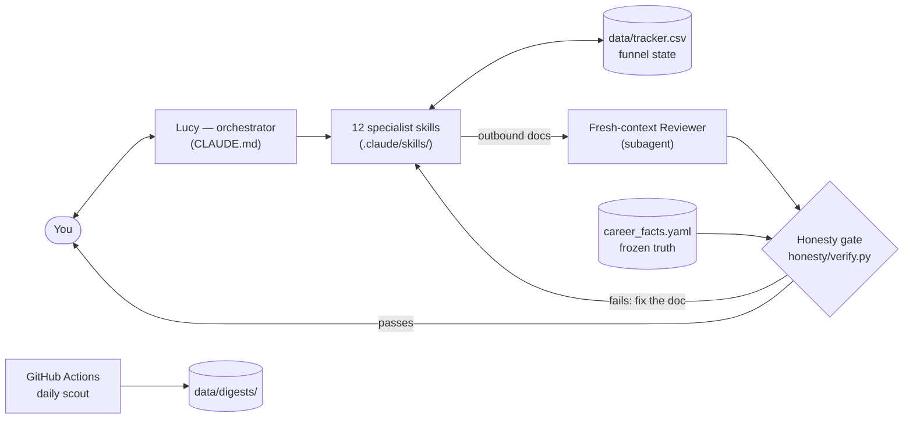

# AI Job Search Agent

**Meet Lucy. One agent you talk to across your entire job search, from discovering a role to
walking into the interview holding the hiring manager's own playbook.**

Job hunting is a funnel: discover roles → judge fit → tailor documents → **find a warm path
in** → apply → track → interview → offer → negotiate. Most tools automate one stage and leave
you to stitch the rest together by hand. Lucy manages the whole funnel from one conversation.

## 5 things to know first

- **You talk, she routes.** Plain language in, finished work out. 12 specialists cover the
  funnel; you never call one directly and there is nothing to memorise.
- **She cannot invent a fact about you.** Every outbound document is checked in code
  (`honesty/verify.py`) against your frozen `career_facts.yaml` before it can leave the
  system. A claim not backed by your real history fails loudly.
- **You commit, she never does.** Automation stops at the moment of applying, reaching out,
  or accepting. The submit path enforces this with 2 independent locks.
- **She finds your warm path in.** You upload your own LinkedIn connections export, and Lucy
  maps who can bridge you into a target company. She also preps you for interviews from the
  interviewer's side of the table.
- **She runs on what you already pay for.** Interactive use works on a regular Claude
  subscription through [Claude Code](https://docs.claude.com/en/docs/claude-code/overview),
  no API key needed. The optional overnight scout costs a few dollars a month on an API key.
  There is no hosted service: your data, your machine, your logic.

Setup takes about 15 minutes plus one honest conversation to build your profile. The profile
decides output quality. Invest there, not in configuration files.

---

## Before you start

You need 3 things. 2 you may already have.

- **A Claude account.** Pro or Max subscription at [claude.ai](https://claude.ai), or an
  Anthropic API key from [console.anthropic.com](https://console.anthropic.com). The
  subscription is the simpler and usually cheaper path for interactive use.
- **Node.js.** Claude Code installs through npm ([nodejs.org](https://nodejs.org)).
- **Python 3.** For the honesty gate and the scout pipeline. 1 dependency:
  `pip install pyyaml`.

Useful to gather before your profile session, none required to start:

- Your current CV
- Your LinkedIn connections export (LinkedIn → Settings → Data Privacy → Get a copy of your
  data → **Connections**). You upload this yourself; it is what powers the warm-intro layer.
- Past cover letters, references, anything that documents what you have actually done

---

## Setup

**Recommended: let Claude walk you through it.**

If you do not have Claude Code installed yet, open [claude.ai](https://claude.ai) and paste this:

> I'm setting up an AI job-search agent that runs in Claude Code. The repo is at
> https://github.com/HimadriTrying/ai-job-search-agent. Walk me through it step by step:
> installing Claude Code, cloning the repo, and starting the setup interview. I'm on
> [Mac / Windows / Linux].

Claude reads this README and guides you through each step. Once you are inside Claude Code,
**Lucy takes over as your guide.** Setup from that point is a conversation, not a checklist.

**Prefer to do it yourself?** 5 steps:

1. Install Claude Code and clone the repo
2. Run the setup interview, where Lucy builds your profile
3. Freeze your facts, the honesty gate's source of truth
4. Run your first discovery sweep
5. Optional: turn on the scheduled morning scout

### Step 1: Install Claude Code and clone the repo

```bash
npm install -g @anthropic-ai/claude-code
git clone https://github.com/HimadriTrying/ai-job-search-agent.git
cd ai-job-search-agent
pip install pyyaml
claude
```

The first `claude` launch signs you in with your Claude account. `CLAUDE.md` loads
automatically. That file *is* Lucy.

**Planning to use the scheduled scout later?** Fork the repo on GitHub first and clone your
fork instead. The scheduled runs happen in your fork's GitHub Actions, under your control.

### Step 2: Run the setup interview

Inside Claude Code, say:

> run setup

Lucy interviews you and fills in `profile/*.md`: your background, how you evaluate roles, how
you actually write, your interview stories. This is the whole game. A thin profile produces
generic output; a deep one produces documents that sound like you. Start using the system
after the first pass and keep deepening it across sessions.

Everything personal stays on your machine:

- `career_facts.yaml`, your filled `profile/*.md`, and `data/` are gitignored
- A pre-commit guard (`scripts/check-private.sh`) blocks private files from ever reaching a
  public repo
- The committed `*.example` versions are what keep the repo forkable

### Step 3: Create your facts file

During setup, Lucy also fills `career_facts.yaml`: every employer, title, date, credential,
and metric you can actually defend. This file is the source of truth for the honesty gate.

- `honesty/verify.py` checks every outbound document (CV, cover letter, outreach message)
  against it before the document can leave the system
- If a draft claims something the file does not contain, the gate fails loudly and the
  document gets fixed. Never the facts.
- This is enforced in code, not in a prompt. It is the reason the system is safe to
  represent your real history.

### Step 4: Run your first discovery sweep

Tell Lucy what you are looking for, or just say:

> what's out there for me?

What the scout does:

- Sweeps public ATS APIs (Greenhouse, Lever, Ashby, SmartRecruiters). No scraping, no logins.
- Hard-drops out-of-band roles before any model call
- Scores survivors with a penalty-first rubric and sorts them into **apply first / worth a
  look / skipped**, with a 1-line reason each
- Writes the digest to `data/digests/YYYY-MM-DD.md`

2 files control it, both in `.claude/skills/job-scout/`:

- **`watchlist.txt`**: your target companies, one `ats:token` per line, for example
  `greenhouse:stripe`. Copy `watchlist.example.txt` to start. Give Lucy company names and she
  looks up the right ATS and token for each.
- **`config.yaml`**: the rubric knobs. Your years of experience, the seniority floor,
  locations, excluded industries, comp floor. Copy `config.example.yaml` and edit, or ask
  Lucy to fill it from your profile.

**Note the seniority floor.** It drops roles *below* Senior, the inverse of the usual
junior-candidate filter. Tuned for Senior / Lead / Staff / Group PM and AI-product-builder
roles out of the box. Set `min_seniority` to wherever your floor is.

### Step 5 (optional): turn on the scheduled morning scout

The 1 piece that benefits from running while you sleep. On your **fork**:

1. Go to the **Actions** tab and click **"I understand my workflows, go ahead and enable
   them"**. GitHub disables Actions on forks by default; without this the scout never runs.
2. Add 1 secret: **Settings → Secrets and variables → Actions → New repository secret**.
   Name it `ANTHROPIC_API_KEY`, paste a key from
   [console.anthropic.com](https://console.anthropic.com).
3. Done. `.github/workflows/daily-scout.yml` runs weekday mornings, sweeps your watchlist,
   and commits the digest to `data/digests/`.

Why this split is deliberate:

- The sweep and scoring are plain Python, so the API key pays only for the thin
  orchestration around them. A few dollars a month.
- Everything expensive and judgment-heavy (tailoring, outreach, negotiation) stays on
  demand, so a scheduled job never eats your interactive quota.

---

## Daily use

Open Claude Code in the repo and talk to Lucy. She routes to the right specialist.

| Say something like… | What happens |
|---|---|
| "what's out there for me?" | discovery sweep + scored digest |
| "tailor my CV for this posting: \<url\>" | CV drafted → fresh-context review → honesty gate |
| "write the cover letter" | same pipeline, in your voice, only real facts |
| "what do I need to know about \<company\>?" | company research briefing |
| "who do I know there?" | warm-intro paths from your own connections export |
| "prep me for Thursday's interview" | prep from the *interviewer's* rubric, inverted |
| "what should I follow up on?" | tracker nudges by elapsed time |
| "I got an offer, help" | benchmark, strategy, scripts |

2 things Lucy will never do: invent a fact about you, and press submit on your behalf.
Applying, reaching out, accepting: the human commits, always.

---

## Adjusting as you go

- **Scout too noisy or too quiet?** Edit the bucket thresholds and rubric knobs in
  `.claude/skills/job-scout/config.yaml`, or tell Lucy which digest calls were wrong and she
  adjusts the knobs for you.
- **Your search evolves?** Re-run any part of setup. Profile files are living documents.
- **New target companies?** Add lines to `watchlist.txt`. The next sweep picks them up.
- **Your history changes?** New role, new credential: update `career_facts.yaml`. That is
  the only time it changes.

---

## Troubleshooting

- **The digest is empty / nothing survives scoring.** Usually the seniority floor doing its
  job on a watchlist with no senior openings right now. Check the sweep counts in the digest
  header, then loosen `min_seniority` or set `keep_ambiguous: true` in `config.yaml` to
  verify roles flow through at all.
- **The honesty gate keeps failing my cover letter.** Working as intended: the draft claims
  something `career_facts.yaml` cannot back. Read the gate's output. Either the claim is real
  and missing from the facts file (add it there), or it is not (the document gets rewritten).
  Never weaken a fact to pass the gate.
- **The scheduled scout never ran.** Check in order: Actions enabled on your fork?
  `ANTHROPIC_API_KEY` secret set? Then read the run log under the Actions tab; the workflow
  prints exactly where it stopped.
- **`honesty/verify.py` errors on import.** `pip install pyyaml`. It is the only dependency.
- **Is this expensive?** Interactive work runs on your Claude subscription. The scout's sweep
  and scoring are pure Python. Paid judgment is routed only to where judgment is actually
  needed.

---

## Roadmap

The full roadmap lives in [ROADMAP.md](ROADMAP.md): what is shipped, what is being built now,
and what comes next, with the hypothesis behind every item.

## Contributing

Ideas, feature requests, and PRs are welcome:

- Open a [GitHub Issue](https://github.com/HimadriTrying/ai-job-search-agent/issues) for
  ideas and feature suggestions, or a PR if you have built something
- Everything is reviewed by the maintainer before merging
- 2 things are not up for change: the agent never fabricates, and the human always submits

## The build is itself the portfolio

This is a multi-agent system on Claude Code: skills, subagent orchestration, an evals-style
honesty gate, scheduled headless runs. For an AI-product role, the repo is the work sample.

### Architecture at a glance



Every outbound document flows through the Reviewer and then the code-enforced honesty gate
before it reaches you; nothing is ever submitted anywhere except by you. The scheduled scout
is the only piece that runs unattended, and it only ever writes a digest.

## Repo layout

```
CLAUDE.md              # the orchestrator brain (always loaded)
career_facts.yaml      # frozen source of truth for the honesty gate (private; see .example)
honesty/verify.py      # the code-enforced honesty gate
profile/               # your brain (fill this first; see profile/00-README.md)
.claude/skills/        # the 12 specialists (auto-triggerable + /name invocable)
.claude/agents/        # the fresh-context reviewer subagent
data/                  # tracker (funnel state) + digests + your connections export (private)
.github/workflows/     # the scheduled "runs while you sleep" scout
docs/DESIGN.md         # the architecture rationale
ROADMAP.md             # what is shipped, in progress, and next, with per-item hypotheses
```

## Acknowledgements

This system was designed after studying public job-search automation, for example
[Scotty Peterson's funnel write-up](https://www.scottypeterson.net/blog/job-hunting-is-a-funnel-problem)
on discovery and scoring, Mads Lorentzen's
[`ai-job-search`](https://github.com/MadsLorentzen/ai-job-search) (MIT) on the drafter and
reviewer pattern, and [Lenny's Product Skills](https://github.com/RefoundAI/lenny-skills)
(MIT) on interview and career framing. MIT licensed.

---

*README v2: rewritten so the things you need to know come first, setup is a guided
conversation, and costs are stated upfront. v1 lives in git history.*
